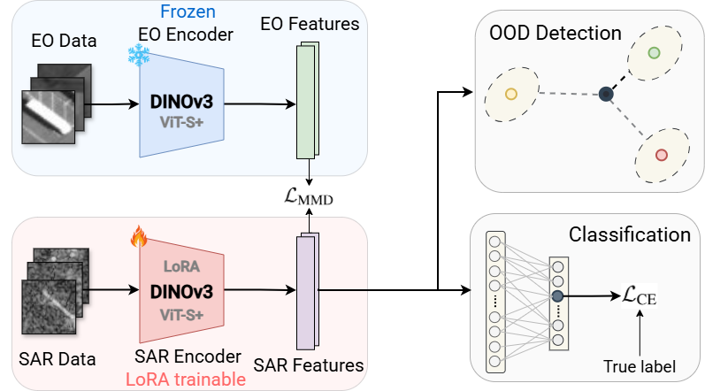

# Team IDCOM Solution: 5th Multi-modal Aerial View Imagery Challenge: Classification (MAVIC-C)

### 3rd Place Overall | 1st Place for OOD Detection (Best AUROC & TNR@TPR95)

**Authors**: [Lucas Hirsch](https://luhirsch.github.io/), [Mike Davies](https://eng.ed.ac.uk/about/people/professor-michael-e-davies)

**Affiliation**: Institute for Imaging, Data and Communications (IDCOM), School of Engineering, University of Edinburgh, UK

*View the official [CodaBench Leaderboard](https://www.codabench.org/competitions/12529/)*


## Quickstart
For running the code, please follow these steps:

- Install required packages and download DINOv3 weights ([Installation](#installation))
- Configure paths in `config.yaml`. Start by copying `config-example.yaml`  ([Configuration](#configuration))
- Put images in `data` folder and organize validation data by running `cd data; python organize_val_data.py` ([Data Setup](#data-setup))
- Run training, feature extraction and inference ([Usage](#usage))
  - Training: `src/train_eo_alignment.py`
  - Feature extraction: `src/extract_features.py`
  - Inference: `src/inference.py`
- Final results are saved in `submission.csv`

Feel free to reach out if you have any questions or issues.

---

## Solution Overview
This repository contains Team IDCOM's solution to the MAVIC-C 2026 competition held at CVPR as part of the PBVS workshop.

The solution proposes a cross-modal alignment framework that exploits the image recognition capabilities of the newly released DINOv3 foundation model.
We employ feature matching to align a trainable Synthetic Aperture Radar (SAR) feature space to a frozen Electro-Optical (EO) reference.

A core component of the architecture is the decoupling of the image classification and the Out of Distribution (OOD) detection.
A simple linear classifier handles classification, while OOD confidence scores are computed independently as the minimum Mahalanobis distance to class centroids in feature space.
This completely avoids the overconfidence flaws of standard logits or softmax probabilities.




## Results
Team IDCOM achieved 3rd place overall with a total score of 0.38.

**Performance metrics**:
 - Accuracy (Top-1): **24.8** %
 - AUROC: **0.78** (Competition Best)
 - TNR@TPR95: **0.27** (Competition Best)

---

## Installation

## Installation

Major requirements:
 - DINOv3: Clone the DINOv3 repo and download weights from the [official repo](https://github.com/facebookresearch/dinov3). Make sure to download ViT-S+ (web images) **and** ViT-L (satellite images) weights.
 - PyTorch: DINOv3 requires a recent PyTorch version, this project uses PyTorch 2.6.
 - LoRA Finetuning: `peft` is a [parameter efficient fine tuning](https://github.com/huggingface/peft) library used for the LoRA fine tuning of the DINOv3 backbone.

Other standard packages like `numpy`, `pandas`, `scikit-learn`, etc. are also required.

> **Note:** PyTorch and torchvision are not included in `requirements.txt` as they
> require a manual installation depending on your CUDA version. Install them first
> from [pytorch.org](https://pytorch.org/get-started/locally/), then install the
> remaining requirements with:
> ```bash
> pip install -r requirements.txt
> ```


**Optional:** For a quick rundown of how to use the DINOv3 model, please check out the file [DINOv3_quickstart.ipynb](DINOv3_quickstart.ipynb).

---
## Configuration

All paths are configured in a single `config.yaml` file in the project root. To get started:
```bash
cp config.example.yaml config.yaml
```

Then edit `config.yaml` with your paths. The two entries that **always require updating** are the DINOv3 repo and weights paths. Dataset paths can be left as defaults if you place the MAVIC-C data in the `data/` folder (see [Data Setup](#data-setup) below).
```yaml
paths:
  dino_repo: "/path/to/dinov3"          # MUST UPDATE
  dino_weights: "/path/to/weights.pth"  # MUST UPDATE
  train_sar: "./data/train/SAR_Train"   # default, change if needed
  ...
```

> **Note:** Paths can be absolute or relative. Relative paths are resolved from the
> project root (where `config.yaml` lives), not from the `src/` directory.
> `config.yaml` is listed in `.gitignore` and will not be committed to the repository.

---

## Data Setup

Data can be downloaded from the [competition website](https://www.codabench.org/competitions/12529/).

Place the MAVIC-C 2025 dataset in the `data/` folder. The expected structure is:
```
data/
├── train/                      # training images (as provided by organizers)
│   ├── SAR_Train/
│   └── EO_Train/
├── val/                        # raw validation images (as provided by organizers)
├── val_organized/              # organized validation images (see below)
├── validation_reference.csv    # provided by organizers
└── test/                       # test images (as provided by organizers)
```

### Organizing the Validation Data
 
The validation images are provided as a flat folder of `.png` files alongside a
`validation_reference.csv` file that maps each image to its class and indicates
whether it is in-distribution (ID) or out-of-distribution (OOD).
 
The training and inference scripts expect the validation data to be organized into
subfolders per class, as required by PyTorch's `ImageFolder`. A helper script is
provided to do this automatically. Run it from the `data/` folder:
 
```bash
cd data
python organize_val_data.py
```
 
This will create a `val_organized/` folder with the following structure:
 
```
val_organized/
├── IID/
│   ├── class_a/
│   ├── class_b/
│   └── ...
└── OOD/
```
 
Make sure the `val_organized_iid` and `val_organized_ood` paths in your `config.yaml` point to the correct folders.

---

## Usage

Below is an overview of how to use the solution. If you need any help running the code, please feel free to reach out.

0. For help using DINOv3, please check out the file [DINOv3_quickstart.ipynb](DINOv3_quickstart.ipynb) or refer to the [official repo](https://github.com/facebookresearch/dinov3)

1. **Training the Model**  
   To train the SAR backbone with LoRA and MMD alignment using the EO reference data, run:
```bash
   python src/train_eo_alignment.py
```
  This will save the best model checkpoint (based on validation F1-score) as a `.pth` file in the `output/` directory as configured in `config.yaml`.

2. **Feature Extraction**  
   To extract features from the SAR backbone, run:
```bash
   python src/extract_features.py
```
  This produces two `.pt` files:
   - **Training features**: used to fit the Mahalanobis OOD detector (class-conditional mean and covariance). This features are obtained from the DINOv3 ViT-L satellite model.
   - **Test features**: TTA-augmented features used at inference time for OOD scoring.

3. **Inference and OOD Detection**  
   To run inference and generate the competition submission, run:
```bash
   python src/inference.py
```
   This classifies the test images, scores them using the Mahalanobis detector and outputs a `submission.csv`.


